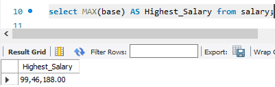
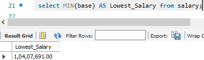
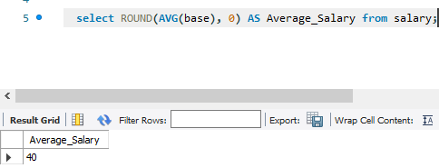
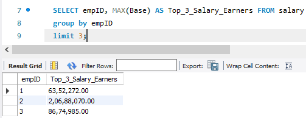

## First Project on MySQL
## Introduction:
The Employee,Department and Salary Datasets serves as a valuable resource for addressing ten key business questions.The analysis focuses on the cleaning and analysis of data,intending to have valuable insights into the organisation.This analysis will give an understanding of the performance of the employee for optimization and growth.

## Problem Statement:
Using the Datasets,It requires that i come up with 10 critical business questions and provide solutions to them ensuring that the solutions has needs for the following SQL COMMANDS below
-JOINS
GROUP BY
HAVING
ROW_NUMBER()
JOIN
SUBQUERY
The 10(Ten) key questions generated were;
- The Highest Salary per annum
- The Lowest Salary per annum
- The Average Salary per annum
- The Top 3(three) Salary Earners  per annum
- Employee's Average Yearly increment per annum
- Employees whose Average Salaries and their Average yearly increment are greater than 4000
- Table showing Employee's Names and their Salaries per annum
- Employee Salaries in ROW NUMBER() by descending order
- Employees whose salaries are above Average
- Table showing Employee's Names and designation

- Result/Discussion:
# The Highest Salary per annum
The highest salary per annum is 99,46,188.00,
- below is a snapshot showing the result and the sql command used to derive the result
- 
- --
# The Lowest Salary per annum
The lowest salary per annum is 1,04,07,691.00,
- below is a snapshot showing the result and the sql command used to derive the result
- 
- --
# The Average Salary per annum is 40 when returned with no decimal place 
- below is a snapshot showing the result and the sql command used to derive the result
- - 
- --
# The Top 3 Salary Earners
- The top 3 Salary earners are as seen in the snapshot below with the command used to derive at the result
- 

